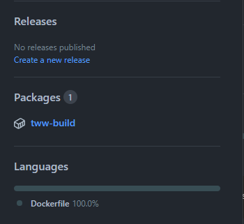
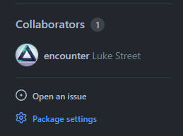
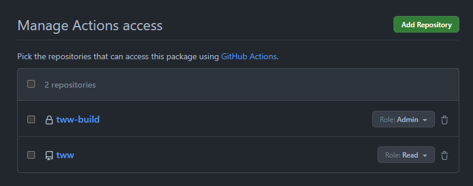

# GitHub Actions

This project's workflow is [.github/workflows/build.yml](../.github/workflows/build.yml).
It follows `encounter/dtk-template-build` and MK Deception's private-container
setup: public sources live in `ShulkMaster/mk-da`, and the required retail DOL
lives in the private `ShulkMaster/mk-da-build` sibling repository.

The private workflow verifies a matching build before publishing
`ghcr.io/shulkmaster/mk-da-build:main`. Its binutils and compiler bundle versions
match the pins in `configure.py`.

- [Build Repository](#build-repository)
- [Workflow](#workflow)
- [decomp.dev](#decompdev)

## Build Repository

This repository will be used to build and store the CI build container.

> [!CAUTION]
> This repository should be **private** to avoid exposing the game's assets.

1. [Create a **private** repository from `encounter/dtk-template-build`](https://github.com/new?template_name=dtk-template-build&template_owner=encounter). A common name is your project's repository name with `-build` appended. For example, `tww-build`.

2. Once the repository is created, add your game's assets to the `orig/GAMEID` directory. (Replace `GAMEID` with your game's ID, matching the `orig` layout in your main repository.)  
    **Only include game files necessary for the build**, such as `sys/main.dol` and any `.rel` or `.sel` files.

3. Once the build container action completes, visit the package settings:  
      
    

4. Under "Manage Actions access", add your project's main repository with the "Read" role:  
    

## Workflow

1. Enable `.github/workflows/build.yml` in your source repository.

2. In `build.yml`, update the `container:` to point to the new [build image](#build-repository).

3. In `build.yml`, replace `GAMEID` with your game's ID. (Or list of IDs, for multi-version support.)

4. Commit and push the changes to your repository.

If everything is set up correctly, the workflow will build all versions on every push or pull request.

## decomp.dev

Once the build workflow is running on the main branch, you can add your game to <https://decomp.dev>.

Visit <https://decomp.dev/manage/new>, select your GitHub repository and fill out the required fields.

If you have questions or issues, try asking in the [GC/Wii Decompilation Discord](https://discord.gg/hKx3FJJgrV) #decomp.dev channel.
